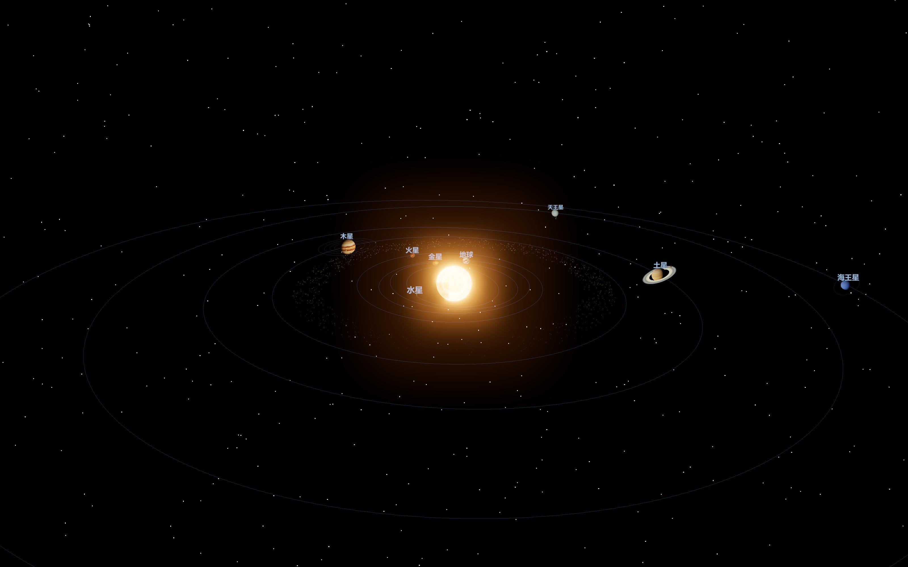
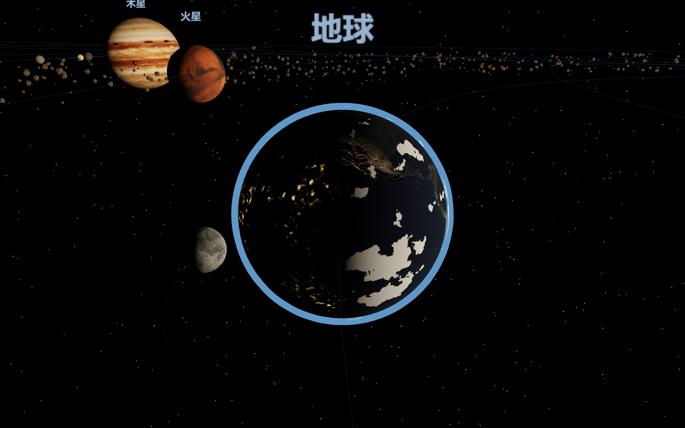
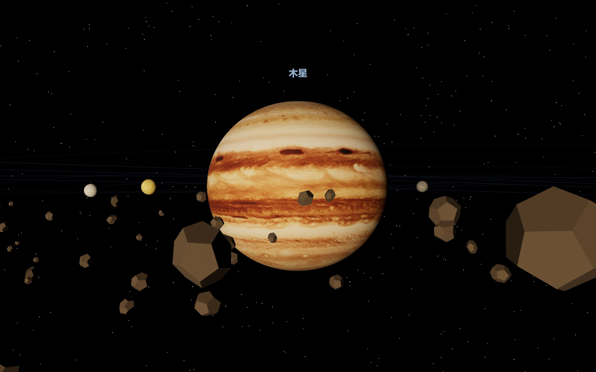
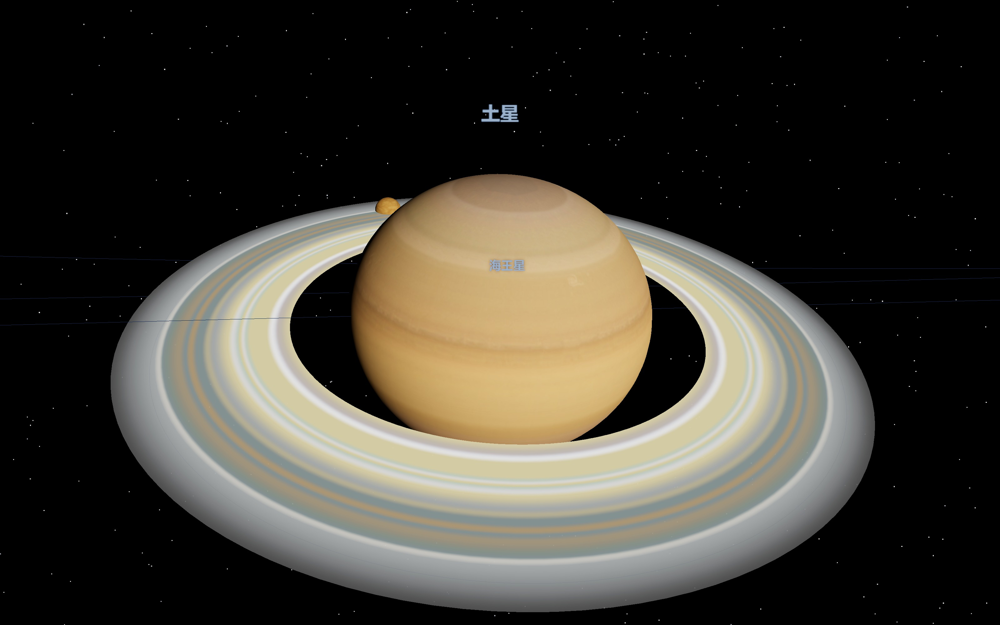
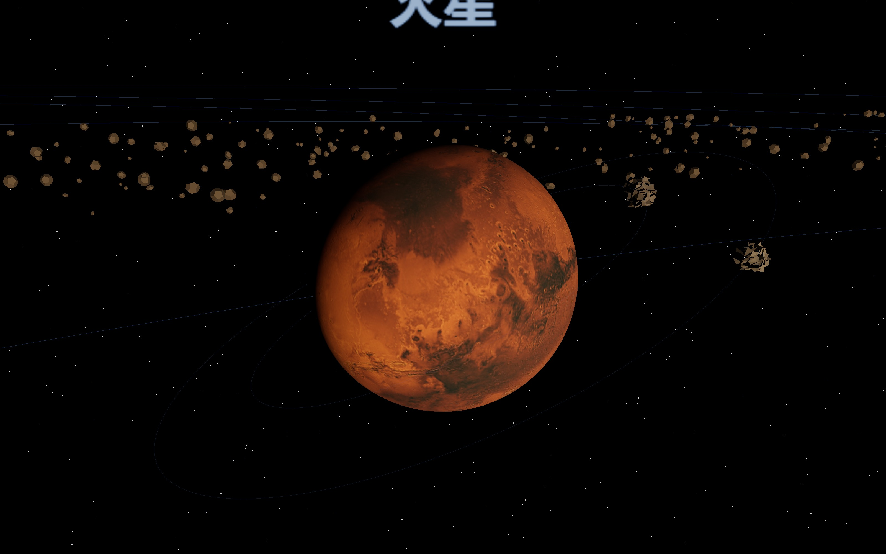
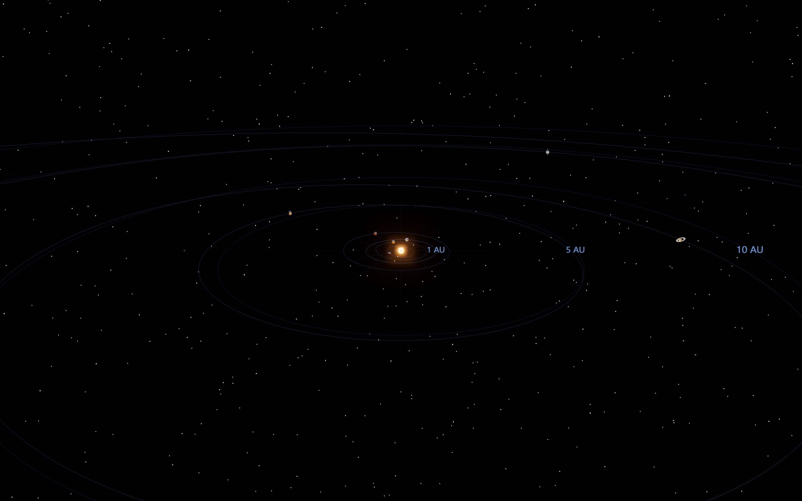

# 太阳系 3D 模型 · Solar System

> 科学级太阳系实时 3D 可视化：**JPL 星历驱动**、真实 NASA 行星贴图、开普勒椭圆轨道、卫星真实根数。可缩放、可拖拽，悬停 / 点击查看天体信息与**实时轨道量**。单文件离线可运行。

**🌐 在线体验 · [Live Demo](https://maoxin1234.github.io/solar-system-3d/)**



---

## 📸 预览

| 地球（真实地表 + 程序化云层与城市夜灯） | 木星（真实云带 + 伽利略卫星） |
| :---: | :---: |
|  |  |
| **土星（真实环纹 + 真实扁率）** | **火星（红色地表）** |
|  |  |

**真实比例模式**（距离与半径按真实比例，附 AU 参考刻度环）：



---

## ✨ 功能特性

- **真实星历轨道**：基于 JPL 开普勒近似根数（J2000 历元 + 世纪变率），开普勒方程数值解算，八大行星位置可对应真实日期。
- **哈雷彗星 (1P/Halley)**：高偏心率逆行椭圆轨道（e=0.967），动态生成背向太阳的**双彗尾**（蓝色离子尾与金色尘埃尾），接近近日点（0.59 AU）时壮观爆发。
- **人类深空探测器**：模拟**旅行者 1 号、旅行者 2 号、新视野号、帕克太阳探测器**的星际逃逸与探测轨迹；高增益天线自动对准地球，实时计算单程与往返光行延迟（RTT）。
- **土星环真球体投射阴影**：土星球体背光面在光环上投下真实的暗黑遮蔽阴影。
- **天体与探测器全局搜索 (Spotlight Search)**：按快捷键 `/` 或搜索框实时过滤天体、卫星与探测器，一键平滑飞至目标。
- **扩展年代**：1800–2050 用 Table 1，区间外自动切换 Table 2（含木–海大不等式项），有效约 **公元前 3000 – 公元 3000**。
- **真实 NASA 贴图**：联网加载八大行星地表、月球、土星环高清贴图；离线自动回退程序化纹理。太阳为实时 HDR 等离子体着色器 + 日冕。
- **真实物理细节**：真实自转周期与方向（金星 / 天王星逆行）、黄赤交角、行星扁率；地球程序化云层与背阳面城市灯光。
- **卫星系统**：9 颗卫星采用真实开普勒根数（a, e, i, 周期），在行星赤道面运行。
- **小行星带**：火–木之间 1500 颗实例化碎块。
- **两种比例**：示意压缩（便于观赏）/ 真实比例（距离 + 半径双真实，远距自动保持最小可见像素）。
- **时间控制**：任意日期跳转、倒放 / 正放、实时 ↔ 2 年/秒 调速、回到此刻。
- **交互**：拖拽旋转、滚轮缩放、悬停信息卡、点击聚焦并显示**实时轨道量**（日心距 / 轨道速度 / 黄经 / 距地球 / 周期 / XYZ 状态矢量 / 探测器光时延迟）。
- **科学诚信**：内置「精度与数据说明」面板，如实标注数据来源、有效范围、已知简化与未建模项。

---

## 🚀 快速开始

### 只想看效果
直接双击 **`index.html`**。无需安装任何东西（联网自动加载高清贴图，离线回退程序化纹理）。

### 开发（修改源码）
源码已模块化在 `src/`，用零依赖的 Node 脚本内联回单文件：

```bash
node build.mjs            # 构建一次 → 生成 index.html
node build.mjs --watch    # 监听 src/ 自动重建（开发推荐）
npm run serve             # 本地预览 http://localhost:4173（可选）
```
开发循环：编辑 `src/` → 构建（或 watch 自动）→ 浏览器刷新。

---

## 🗂 目录结构

```
index.html          ← 构建产物（单文件，可双击离线运行）⚠ 自动生成，勿手改
build.mjs           ← 构建脚本：拼接 src/ → index.html（支持 --watch）
package.json
docs/screenshots/   ← 预览图
src/                ← 源码（在这里改）
 ├─ index.html      ← HTML 模板（importmap + 注入点）
 ├─ styles.css      ← 全部样式
 └─ js/             ← 12 个按职责拆分的源码片段
    00-imports · 01-noise · 02-textures · 03-data · 04-ephemeris
    05-scene · 06-build · 07-graphics · 08-interaction
    09-controls · 10-loop · 11-startup
```

---

## 🔧 构建原理（为什么这样拆）

浏览器在 `file://` 下会用 CORS **拦截本地 ES 模块互相 `import`**——拆成互引的 `.js` 就无法双击打开。

为兼顾「可维护的多文件源码」与「双击离线可运行的单文件」，本项目采用 **按序拼接**：`src/js/*.js` 是共享同一作用域的源码片段（按文件名数字序拼接，three.js 导入统一放在 `00-imports.js`，故片段内不写 `import`/`export`）。`build.mjs` 仅内联 CSS + 按序拼接 JS，**不改写任何代码**，因此构建产物与源码行为严格一致。新增模块：在 `src/js/` 放一个带数字前缀的 `.js` 即可。

---

## 🎮 操作说明

| 操作 | 效果 |
| --- | --- |
| 拖拽 | 旋转视角 |
| 滚轮 | 缩放远近 |
| 悬停天体 | 弹出信息卡 |
| 点击天体 | 飞近聚焦 + 显示实时轨道量 |
| 双击 / Esc | 返回全景 |
| 底部面板 | 日期跳转、调速、倒放、示意/真实比例、轨道/标签/刻度、回到此刻 |

---

## 📐 数据与精度

- 轨道：JPL/SSD 开普勒近似根数（E. M. Standish）；日心黄道 **J2000** 框架（未含岁差）。
- 精度：1800–2050 内行星约 **角分级**（已对 J2000 教科书值核验：地球 0.9833 au / 30.29 km·s⁻¹）。
- 贴图：NASA / three.js / threex.planets，经 CDN；离线回退程序化纹理。
- 卫星：真实开普勒根数；升交点经度与历元相位为稳定近似（非精密卫星星历）。
- **未建模**：行星间引力摄动、章动、相对论效应、光行时修正。
- 需要角秒级精密星历（探测器导航、掩星预报等）请用 **JPL Horizons / SPICE**。

详见运行界面左上角「**ⓘ 精度与数据说明**」。

---

## 🛠 技术栈

[three.js](https://threejs.org) r160（CDN importmap）· WebGL · UnrealBloom 选择性辉光后处理 · 程序化噪声纹理 · 自定义 GLSL 着色器（太阳 / 大气 / 城市夜灯）。

## 📄 许可证

[MIT](LICENSE) © maoxin1234
